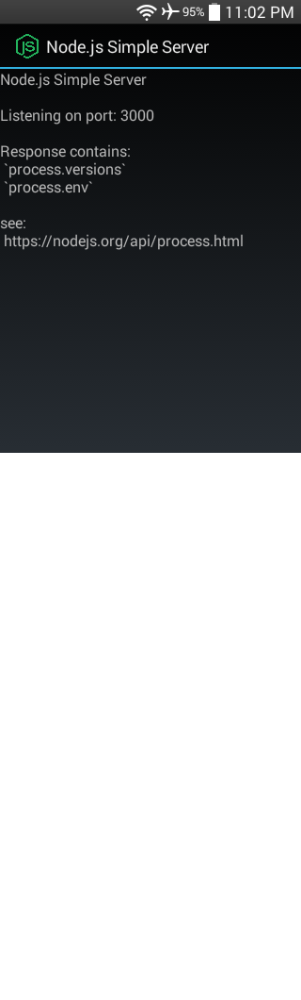
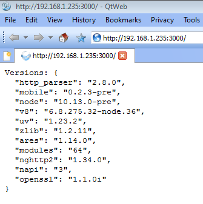

### [Node.js Simple Server](https://github.com/warren-bank/Android-NodeJS-Simple-Server)

Android app to demo running a simple HTTP server using Node.js in Android.

#### Screenshots:

#### Credits:

* [Node.js for Mobile Apps](https://github.com/JaneaSystems/nodejs-mobile) by [Janea Systems](https://github.com/JaneaSystems)
  * [PR#291](https://github.com/JaneaSystems/nodejs-mobile/pull/291) by [Informatic](https://github.com/Informatic/nodejs-mobile/tree/v0.3.2-support-api19) to decrease the Android minSDK from 21 to 19 for 32-bit architectures

#### Design:

* this demo app is based on the official ["native-gradle"](https://github.com/janeasystems/nodejs-mobile-samples/tree/5f07c64eeb8c79abead04145b62f428b6b847553/android/native-gradle) sample app that is described on the ["Getting Started"](https://code.janeasystems.com/nodejs-mobile/getting-started-android) page of the documentation for using _Node.js for Mobile Apps_ in Android
  * license: [MIT](https://github.com/JaneaSystems/nodejs-mobile-samples/blob/5f07c64eeb8c79abead04145b62f428b6b847553/LICENSE)
* it uses Node.js [binaries](https://github.com/warren-bank/nodejs-mobile/releases/tag/nodejs-mobile-v0.3.2-support-api19) built from [PR#291](https://github.com/JaneaSystems/nodejs-mobile/pull/291)
* it makes some changes to:
  * the gradle build scripts
  * the app icon
  * the layout and welcome message in MainActivity

#### Technical Details:

* Node.js for Mobile Apps
  * version: 0.3.2
  * binaries: [nodejs-mobile-v0.3.2-support-api19-android.zip](https://github.com/warren-bank/nodejs-mobile/releases/download/nodejs-mobile-v0.3.2-support-api19/nodejs-mobile-v0.3.2-support-api19-android.zip)
  * minSDK:
    * 32-bit: [19](https://github.com/warren-bank/nodejs-mobile/blob/nodejs-mobile-v0.3.2-support-api19/tools/android_build.sh#L49)
    * 64-bit: [21](https://github.com/warren-bank/nodejs-mobile/blob/nodejs-mobile-v0.3.2-support-api19/tools/android_build.sh#L50)
  * versions:
    * Node.js = 12.19.0
    * OpenSSL = 1.1.1g
* no root

#### List of Permissions:

* android.permission.INTERNET

#### Legal:

* copyright: [Warren Bank](https://github.com/warren-bank)
* license: [GPL-2.0](https://www.gnu.org/licenses/old-licenses/gpl-2.0.txt)
